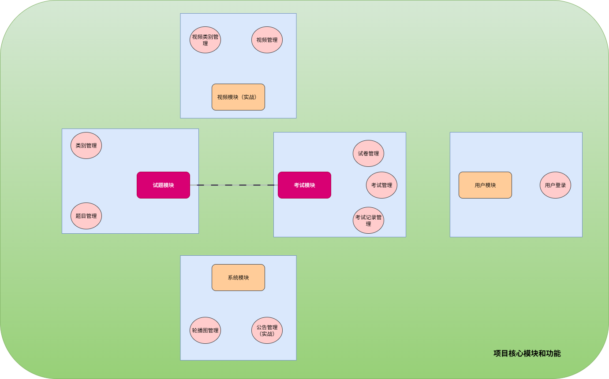

# exam-system
尚硅谷：硅谷AI链习室项目， AI+单体架构Java项目实战



# 环境搭建
## docker部署Minio
[原文](https://zhuanlan.zhihu.com/p/684175456)

```sh
# 1. 创建挂载目录
mkdir -p /opt/minio/config
mkdir -p /opt/minio/data

# 2. 下载镜像
docker pull minio/minio

# 3. 创建容器并运行
docker run \
-p 9000:9000 \
-p 9090:9090 \
--name minio \
-d --restart=always \
-e "MINIO_ACCESS_KEY=minioadmin" \
-e "MINIO_SECRET_KEY=minioadmin" \
-v /opt/minio/data:/data \
-v /opt/minio/config:/root/.minio \
 docker.io/minio/minio:RELEASE.2025-04-22T22-12-26Z server \
/data --console-address ":9090" -address ":9000"

# -p 9000:9000 -p 9090:9090 这是端口映射，前一个是服务器的端口，后一个是客户端也就是api接口访问的端口地址
# –name minio 这是给新创建的容器命名的选项，名字是 “minio”
# -d --restart=always 这是运行容器的其他选项，-d使容器在后台运行，–restart=always表示容器总是会在退出后自动重启
# -e “MINIO_ACCESS_KEY=minioadmin” 用户名
# -e “MINIO_SECRET_KEY=minioadmin” 密码
# -v /opt/minio/data:/data 这意味着将宿主机上的 /opt/minio/data 目录挂载到容器内的 /data 目录
# -v /opt/minio/config:/root/.minio 将宿主机上的 /opt/minio/config 目录挂载到容器内的 /root/.minio 目录
# minio/minio server /data --console-address “:9090” -address “:9000” 这是容器内要运行的命令，启动一个名为 “minio” 的服务器，数据存储在 /data 目录下，服务器的控制台地址为 “:9090”，服务地址为 “:9000”

# \ 换行


# 4. 访问：http://你的IP地址:9090/login 用户名：密码 minioadmin：minioadmin

# 5. 创建用户、创建组
# 6. 创建Buckets、创建Access Key、上传文件

```
```json
// 创建桶策略 #DCE2E3 #000 #00A1D
{
    "Statement": [{
        "Action":"s3:GetObject",
        "Effect": "Allow",
        "Principal": "*",
        "Resource": "arn:aws:s3:::test/*"
    }],
    "Version": "2012-10-17"
}
```

